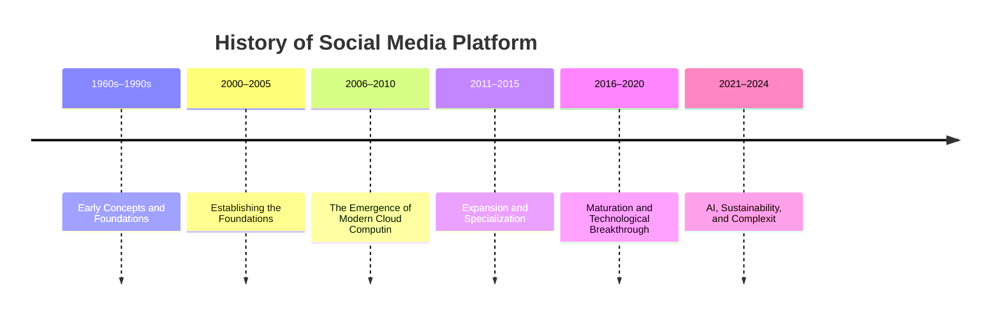
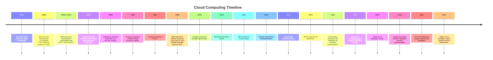

# The Roots of Cloud Computing (1960s–1990s)

Ever wondered how today's cloud computing began its journey? Let's take a trip back to the 1960s, when it all started with a visionary idea. Imagine computing power being as easy to access as electricity or water. Sounds familiar? That's because computer scientist [John McCarthy](https://en.wikipedia.org/wiki/John_McCarthy_\(computer_scientist\)) planted this seed long ago with the concept of [utility computing](https://computinginthecloud.wordpress.com/2008/09/25/utility-cloud-computingflashback-to-1961-prof-john-mccarthy/). Little did he know, this idea would pave the way for the cloud services we rely on today.

But how did this vision turn into a reality? It all started with early pioneers like IBM and MIT, who, in the early 1960s, developed the [Compatible Time-Sharing System (CTSS)](https://en.wikipedia.org/wiki/Compatible_Time-Sharing_System). This system was a game-changer—it allowed multiple users to harness the power of a mainframe computer simultaneously. In other words, it was the first glimpse of sharing computing resources.

Moving into the 1960s and 1970s, IBM took things a step further with virtualization technology. By developing operating systems like [CP-67](https://en.wikipedia.org/wiki/CP/CMS) and [VM/370](http://www.vm.ibm.com/vm40hist.pdf), IBM enabled several operating systems to run on one physical machine. Why was this important? Because sharing resources efficiently through virtualization became a cornerstone of cloud computing, allowing us to scale resources up or down as needed with ease.

And what about the term ‘cloud’? It wasn't until the 1990s that ['cloud'](https://www.technologyreview.com/2011/10/31/257406/who-coined-cloud-computing/) became a buzzword in the world of distributed computing. As the internet blossomed, early remote services like file sharing and email showed us the potential of accessing resources over a network.

# Early 2000s : Laying the Groundwork

Imagine a world transitioning from clunky software CDs to seamless online access. In the early 2000s, this shift began with companies like Salesforce leading the charge. In 1999, they introduced Software as a Service (SaaS), allowing businesses to manage customer relationships directly through the web. This was a game-changer—why worry about installing software when you can access it anytime, anywhere? [Salesforce and SaaS](https://www.salesforce.com/ap/saas/) [Britannica on Salesforce](https://www.britannica.com/money/Salesforcecom).

Then, in 2002, Amazon joined the party by launching Amazon Web Services (AWS), providing basic infrastructure services that many others would soon build upon. [Amazon AWS Launch](https://press.aboutamazon.com/2002/7/amazon-com-launches-web-services-developers-can-now-incorporate-amazon-com-content-and-features-into-their-own-web-sites-extends-welcome-mat-for-developers) [Wikipedia on AWS](https://en.wikipedia.org/wiki/Amazon_Web_Services). Around the same time, Google gave us a glimpse into cloud-based living. Gmail quickly became a hit when it launched in 2004. [History of Gmail](https://en.wikipedia.org/wiki/History_of_Gmail) [Google Announces Gmail](http://googlepress.blogspot.com/2004/04/google-gets-message-launches-gmail.html).

# Mid-2000s to Early 2010s: Cloud Computing Takes Shape

By 2006, AWS had rolled out [Elastic Compute Cloud (EC2)](https://aws.amazon.com/about-aws/whats-new/2006/08/24/announcing-amazon-elastic-compute-cloud-amazon-ec2---beta/) and [Simple Storage Service (S3)](https://en.wikipedia.org/wiki/Amazon_S3), bringing forward the idea of Infrastructure as a Service (IaaS). This allowed businesses to tap into computing power as they needed it—much like turning on a tap for water. The big authorities, like the [National Institute of Standards and Technology (NIST)](https://csrc.nist.gov/glossary/term/infrastructure_as_a_service), helped us get a grasp on this tech wave, officially defining IaaS, Platform as a Service (PaaS), and Software as a Service (SaaS) in this [technical report](https://csrc.nist.gov/glossary/term/infrastructure_as_a_service).

Not one to be left behind, Google introduced [Google App Engine](https://en.wikipedia.org/wiki/Google_App_Engine) in 2008, offering a PaaS setup to ease developers' burdens by taking infrastructure management off their plates. And then came Microsoft with [Azure](https://en.wikipedia.org/wiki/Microsoft_Azure) in 2010, offering unique hybrid cloud solutions and firmly staking its claim in the evolving landscape.

But why were businesses so eager to jump on the cloud bandwagon? The allure was clear—cost savings and the ability to scale quickly were hard to resist. SaaS applications like Google Docs and Dropbox became household names as they spread across companies globally. [The History of SaaS: Evolution and Challenges](https://lemonlearning.com/blog/the-history-of-saas-evolution-and-challenges).

Of course, not everything was smooth sailing. In regulated sectors, there were many concerns regarding security and reliability. And, let's not forget that limited bandwidth and latency were still on limiting factors in the adoption of cloud solutions.

# The Journey from 2011 to 2015: Expansion and Specialization

Back in the early 2010s, things really started to pick up momentum. In 2011, IBM’s [SmartCloud](https://www.ibm.com/cloud-computing/SmartCloudMilestones_060413.pdf) made its debut, offering hybrid cloud solutions that were particularly appealing to enterprises. If you are familiar with [VMware](https://www.ibm.com/think/topics/vmware), you may know how their virtualization technologies simplify private cloud deployments, making life a bit easier for businesses.

Fast forward to 2013, and a game-changing development came about—[Docker](https://www.docker.com/resources/what-container/). Docker didn’t just introduce containerization; it made deploying applications across various cloud environments as easy as pie. This laid the groundwork for what we now know as microservices architectures.

Yet, it wasn’t all smooth sailing. Remember the 2014 [[ iCloud | iCloud Data Breach]] ? Those incidents reminded everyone of the security vulnerabilities lurking in cloud storage services and caused a temporary dip in user trust. On the flip side, [Netflix's complete migration to AWS](https://about.netflix.com/news/completing-the-netflix-cloud-migration) showed just how scalable and robust cloud services could be for high-demand platforms.

Cloud reliability came under scrutiny as well, with infamous service outages like [AWS’s downtime in 2012](https://aws.amazon.com/message/680342/) raising eyebrows. And what about [vendor lock-in](https://www.cloudflare.com/learning/cloud/what-is-vendor-lock-in/)? Many organizations started to feel the pinch when attempting to switch providers. It was a mixed bag of advancements and challenges, wasn't it?

# The Leap from 2016 to 2020: Maturation and Technological Breakthroughs

As we moved further into the mid-2010s, cloud computing wasn’t just an auxiliary tool anymore—it became a cornerstone of enterprise IT strategies. Do you know what became the talk of the town in 2016? [Kubernetes](https://kubernetes.io/docs/concepts/overview/). This tool turned into the go-to standard for managing containerized applications, making cloud-native development even more efficient.

Then came 2017 with the rise of [serverless computing](https://aws.amazon.com/lambda/). With services like AWS Lambda, developers found they could execute code without worrying about infrastructure. How liberating does that sound?

By 2019, [multi-cloud strategies](https://www.cloudflare.com/fr-fr/learning/cloud/what-is-multicloud/) were the name of the game. Organizations wanted to spread their wings and reduce reliance on any single provider for better resilience. Cloud providers didn’t just sit back; they integrated AI and machine learning to enhance analytics and automation, laying the ground for more intelligent cloud services. Did you notice edge computing making waves too? It started working hand-in-hand with centralized cloud systems to drastically cut down on latency for critical applications.

However, there were lessons to be learned. The [[Capital_One | Capital One data breach in 2019]] , due to misconfigured AWS settings, was a stark reminder of the ongoing security challenges. And rising operational costs led to 23% budget overruns — definitely a wake-up call for improved resource management.

# **2021–2024: Embracing AI, Sustainability, and Complexity in the Cloud** 

Have you ever wondered how today's technology landscape has been shaped by the powerful trio of AI, cloud computing, and hybrid cloud architectures? As we navigate the 2020s, these elements have become central to how businesses operate. By 2021, a whopping [87% of enterprises](https://www.flexera.com/about-us/press-center/flexera-releases-2021-state-of-the-cloud-report) adopted hybrid cloud strategies, benefiting from the blend of public and private infrastructures. What drove this shift? The rise of AI models like ChatGPT, which require robust, GPU-powered cloud systems, has certainly played a part, stretching the resources of cloud providers, as noted in an article discussing [AI's impact on cloud computing](https://technologymagazine.com/articles/how-ai-is-changing-the-cloud-landscape) (2023).

At the same time, there's been a big push for sustainability. By [2024](https://www.statista.com/statistics/817296/worldwide-enterprise-cloud-strategy/), many major cloud providers aim to be carbon-neutral. They’re also introducing AI-driven FinOps tools to streamline cloud costs with smart automation, as highlighted by a [study](https://www.tangoe.com/news/companies-using-ai-enabled-tools-for-finops-save-more-than-20/) showing significant savings through these technologies. Additionally, tailored cloud platforms for industries like healthcare and finance are helping organizations meet regulatory requirements more efficiently.

But, it's not all smooth sailing. The demand for specialized skills in cloud governance remains high, and many businesses are grappling with expertise gaps. For instance, a report indicates that [cloud governance skills](https://www.linkedin.com/business/talent/blog/talent-strategy/linkedin-most-in-demand-hard-and-soft-skills) are among the top hard skills in demand for 2024. With increasing data sovereignty regulations, some companies are even moving workloads back to on-premise solutions.

# **Looking Back at Success Stories**

Curious about how some major players have thrived in the cloud landscape? Take Amazon Web Services (AWS), for example. It has been instrumental in the success of countless organizations. Remember Netflix? They've harnessed [AWS’s machine learning capabilities](https://siliconvalley.center/blog/success-stories-industry-cloud-platforms-in-action) to create personalized user experiences, boosting customer satisfaction and loyalty. Then there's Airbnb, which turned to AWS to manage its massive data needs. The scalability and flexibility of the cloud have allowed them to keep pace with their rapid growth, as further detailed in [industry success stories](https://hawatel.com/en/blog/how-do-large-companies-use-aws-success-stories-of-netflix-slack-airbnb-and-expedia).

