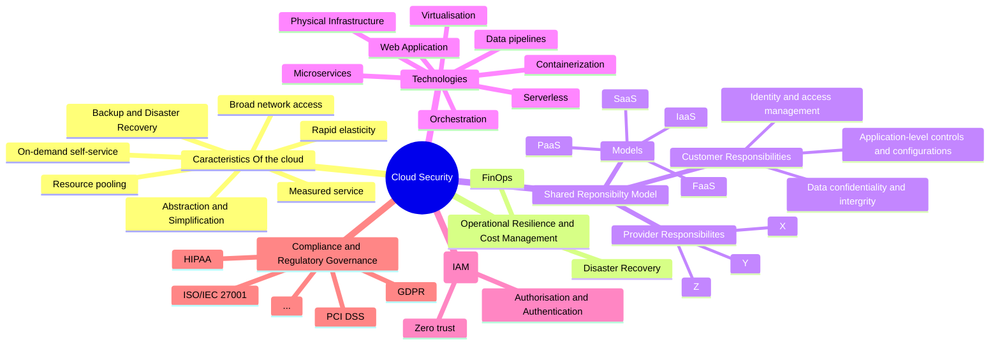
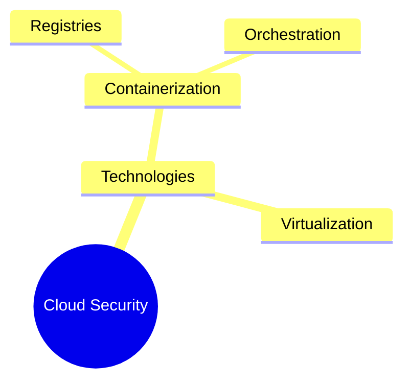

In our quest to understand the vast landscape of cloud security, we've ventured into all corners of the digital world. Have you ever wondered just how complex and interconnected this field truly is? Let's break it down together.

Imagine creating a detailed map that captures everything we've encountered on our journey. It's like piecing together a puzzle where each section, from hardware and software to gouvernance and IAM, plays a crucial role in the bigger picture of security. Sound complicated? 

As we sifted through [[1-How it started|Online research]] and [[2-Article Review|insightful articles]], we started to see a clearer picture emerge, highlighting how diverse yet interrelated these topics are. Take Infrastructure as a Service (IaaS), for instance. It's a unique concept, but you may guess that it involves on-demand self-service and is guided by a shared responsibility model? It relies heavily on technologies like containers and virtual machines and also needs careful consideration of compliance and cost management.

All these interconnections contribute to the complexity of cloud security, making it challenging to create a neat and tidy overview. So here is our best shot at it :

