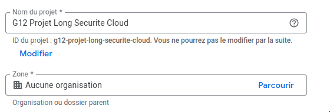

## Getting Started with Authorizations in Google Cloud: A Step-by-Step Guide

Hey there! Ready to dive into setting up your Google Cloud project? If you're new to cloud security, don’t worry—we’re here to walk you through it. Let’s break down the process together, starting with creating your project and setting up essential permissions.

### Step 1: Create Your Google Cloud Project

First things first, you'll need a project to get started. Here’s how you can create one:

1. Head over to the [Google Cloud Console](https://console.cloud.google.com/).
2. Notice the project drop-down menu at the top? Click on it.
3. Click "New Project" to kick off your creation process.
4. Think of a cool name for your project and select a billing account.
5. Hit "Create" and voilà, your project is ready to roll!



### Step 2: Crafting a Service Account

Next, let’s set up a service account to manage permissions. Don’t worry; we’ll keep it simple!

1. In the Google Cloud Console, swing by the "IAM & Admin" section.
2. On the left, click "Service Accounts."
3. You'll spot "Create Service Account" at the top—click it.
4. Give your service account a name and description. Easy, right?
5. Click "Create and Continue."
6. It's time for roles! Assign these roles to your service account to give it the right permissions:
   - **Compute Viewer** (`roles/compute.viewer`)
   - **Compute Instance Admin (v1)** (`roles/compute.instanceAdmin.v1`)
   - **Compute OS Admin Login** (`roles/compute.osAdminLogin`)
   - **Compute Security Admin** (`roles/compute.securityAdmin`)
   - **Compute Image User** (`roles/compute.imageUser`)
   - **Service Account User** (`roles/iam.serviceAccountUser`)
7. Click "Done" to wrap up the setup.

---

Take a look in the "IAM & Admin" > "IAM" section—you’ve just crafted a robust configuration, like this one:

![[Pasted image 20250308020706.png]]

Wondering why these roles are important? Let’s break it down:

- **Compute Viewer** lets you view resources without altering them—perfect for keeping an eye on things.
- **Compute Instance Admin (v1)** empowers you to manage VM instances, like starting or stopping them.
- **Compute OS Admin Login** allows secure SSH connections to your Linux VM instances.
- **Compute Security Admin** is key for managing firewall rules and security settings.
- **Compute Image User** helps in deploying instances from specific images.
- **Service Account User** lets your deployment process utilize a service account for other Google Cloud services.

>[!warning]
>Remember: It’s best to keep tasks specific to the service account to ensure security. Stick to the principle of least privilege!

## Automating Your Deployments: Enter OpenTofu

Ready to make things even smoother? Automating deployments is the way to go. Here's how to gear up for it:

First, confirm you have Terraform or OpenTofu installed. Follow the detailed [Terraform instructions](https://developer.hashicorp.com/terraform/install) or [OpenTofu instructions](https://opentofu.org/docs/intro/install) to get set up. We’ll go with OpenTofu because it’s open-source and user-friendly.

### Step 1: Enabling the Cloud Resource Manager API

Let’s enable the Cloud Resource Manager API to keep moving forward:

1. Navigate to "APIs & Services" in the Google Cloud Console.
2. Click "Library" on the left.
3. Look up "Cloud Resource Manager API" and click on it.
4. Activate it by clicking "Enable."

![[Pasted image 20250308020516.png]]

Also, repeat this for the **Compute Engine API**.

### Step 2: Kickstart a Tofu Project

It’s time to get our hands on with OpenTofu:

1. Open your terminal or command prompt.
2. Create a new directory for your upcoming project:
   ```bash
   mkdir my-tofu-project
   cd my-tofu-project
   ```
3. Initialize the project with:
   ```bash
   tofu init
   ```
4. Draft a Tofu configuration, like `main.tf`, to define your resources.

### Step 3: Clone Our Repository for Quick Setup

Looking for a fast start? Cloning our repository can save you time.

1. Clone the repository with:
   ```bash
   git clone https://github.com/Aitbytes/Projet-Long-Infra
   ```
2. Jump into the `k3s-php` directory:
   ```bash
   cd Projet-Long-Infra/k3s-php
   ```
3. Check out the `README.md` for further steps or run the included scripts to set up your environment.

Whether you’re using our scripts or crafting your own, our [[Provisioning|How to deploy with Terraform]] guide will illuminate the path.

![Tofu Project Example]

Great job! If you've reached deploying the cluster, it’s time to dive into [[Configuration|Configuring Kubernetes with k3s and Ansible]]. You're on an exciting journey to mastering cloud deployments!

