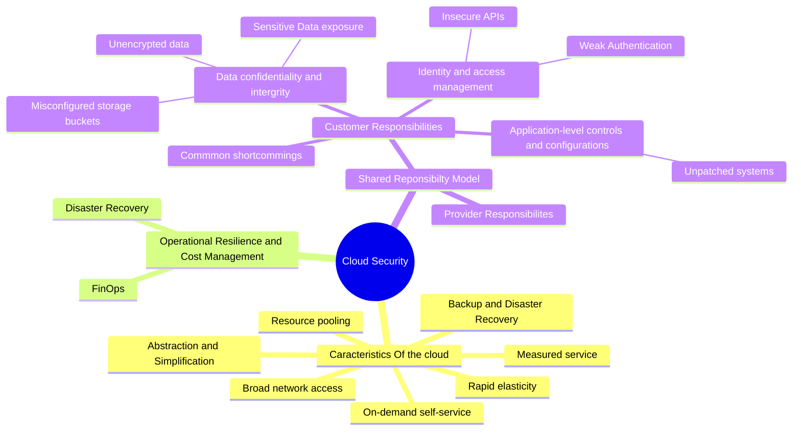

So, you're diving into the world of cloud security? Let's break it down in simple terms and explore why it’s such a game-changer in today’s tech landscape.

[**What Exactly is Cloud Infrastructure?**](https://www.techtarget.com/searchcloudcomputing/definition/cloud-infrastructure?utm_source=chatgpt.com)

Think of cloud as a blend of hardware and software components—like servers and networks—working together over the internet. But instead of having stacks of hardware on-site, these resources are virtualized. This means you can easily tap into them whenever you need, providing scalable and flexible solutions right at your fingertips. Have you ever needed more storage or processing power without the fuss of installing new hardware? That’s the beauty of cloud computing!

**Key Features that Make Cloud Infrastructure Stand Out ([synopsis](https://www.synopsys.com/blogs/chip-design/essential-cloud-computing-characteristics.html?utm_source=chatgpt.com)):**

1. **On-Demand Self-Service:** Need more storage or processing power? You can get it without waiting for someone to approve or set it up for you.
    
2. **Broad Network Access:** Whether you're using a smartphone, tablet, or laptop, cloud services are always just a few clicks away.
    
3. **Resource Pooling:** Imagine a giant pool of resources the provider manages, and you only take what you need. It’s like electricity; you just plug in and use what you require.
    
4. **Rapid Elasticity:** As your needs grow or shrink, the cloud adjusts instantly, almost like magic!
    
5. **Measured Service:** This is akin to paying your utility bills. You only get charged for what you use, and both you and your provider can track usage.
    

**Protecting Your Data: Security Principles in Cloud Infrastructure**

When it comes to security, the cloud has you covered with several robust principles:

- **Data Encryption:** This is like locking up your valuables. Your data stays secure, whether it's on the move or at rest.
    
- **Identity and Access Management (IAM):** Similar to a bouncer at a club, only specific, authorized people get access.
    
- **Regular Auditing and Monitoring:** This keeps an eye on everything to highlight anything fishy and ensure compliance with security rules.
    
- **Shared Responsibility Model:** Security isn’t just the provider’s job. It’s a team effort between you and the provider, with clearly defined roles.
    

**How Does Cloud Compare to Other Setups?**

Let's see how the cloud stacks up against other computing environments:

1. **Traditional On-Premises Computing:**
    
    - You own everything, but it’s like buying a house; you handle all maintenance and upgrades.
    - Scaling up means a hefty investment in new hardware.
    - Full control over security is yours, but so is the responsibility for it.
2. **Colocation Data Centers:**
    
    - You own the gear but rent the space.
    - Adding hardware and space can slow down your scaling efforts.
    - The data center offers physical security, but data security is up to you.
3. **Managed Hosting Services:**
    
    - It’s like leasing a car; providers own the hardware.
    - Scaling is easier than on-prem but can still take time.
    - While providers offer security services, ensure they meet your specific needs.

