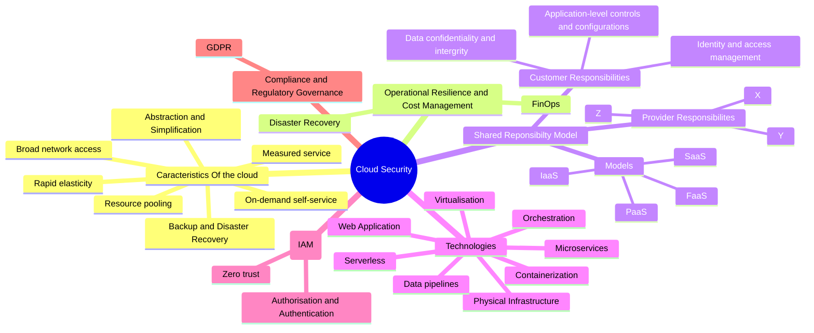
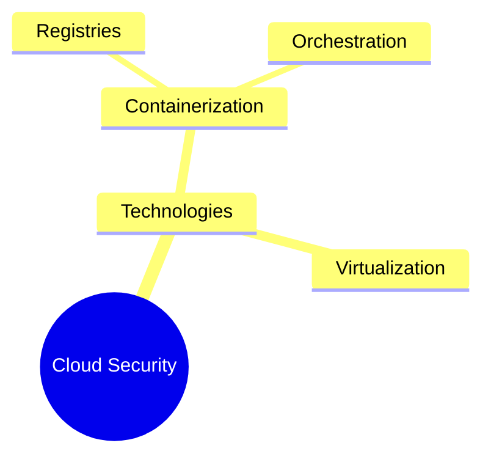

So, you're diving into the world of cloud security? Let's break it down in simple terms and explore why it’s such a game-changer in today’s tech landscape.

[**What Exactly is Cloud Infrastructure?**](https://www.techtarget.com/searchcloudcomputing/definition/cloud-infrastructure?utm_source=chatgpt.com)

Think of cloud as a blend of hardware and software components—like servers and networks—working together over the internet. But instead of having stacks of hardware on-site, these resources are virtualized. This means you can easily tap into them whenever you need, providing scalable and flexible solutions right at your fingertips. Have you ever needed more storage or processing power without the fuss of installing new hardware? That’s the beauty of cloud computing!

**Key Features that Make Cloud Infrastructure Stand Out ([synopsis](https://www.synopsys.com/blogs/chip-design/essential-cloud-computing-characteristics.html?utm_source=chatgpt.com)):**

1. **On-Demand Self-Service:** Need more storage or processing power? You can get it without waiting for someone to approve or set it up for you.
    
2. **Broad Network Access:** Whether you're using a smartphone, tablet, or laptop, cloud services are always just a few clicks away.
    
3. **Resource Pooling:** Imagine a giant pool of resources the provider manages, and you only take what you need. It’s like electricity; you just plug in and use what you require.
    
4. **Rapid Elasticity:** As your needs grow or shrink, the cloud adjusts instantly, almost like magic!
    
5. **Measured Service:** This is akin to paying your utility bills. You only get charged for what you use, and both you and your provider can track usage.

